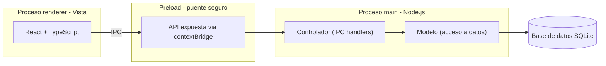

# LibreriaPOS - Documentacion del proyecto

Sistema de gestion de ventas e inventario para libreria, desarrollado con Electron.js como evolucion de un sistema previo en Excel con macros. Este documento registra el proceso de desarrollo completo: decisiones tecnicas, arquitectura, diseno de base de datos, seguridad y diseno de interfaz, a modo de bitacora de aprendizaje y referencia tecnica profesional.

## Indice

1. Contexto y objetivos del proyecto
2. Stack tecnologico
3. Configuracion del entorno
4. Control de versiones
5. Arquitectura del sistema
6. Diseno de interfaz (UI/UX)
7. Diseno de base de datos
8. Seguridad
9. Modulo de Login (autenticacion)
10. Rendimiento y buenas practicas de codigo
11. Roadmap de modulos

---

## Contexto y objetivos del proyecto

El negocio contaba previamente con un sistema de gestion construido en Excel con macros VBA (3 anos en uso activo), que cubre control de inventario (compras al por mayor, precios, stock), registro de ventas con calculo de vuelto, y control de caja (ingresos/egresos). Este proyecto moderniza esa gestion con una aplicacion de escritorio real, sirviendo ademas como proyecto de portafolio profesional.

### Estrategia de desarrollo: MVP primero

Se descarto construir un ERP completo desde el inicio. Fases definidas:

**Fase 1 (MVP - en desarrollo):** Login con roles, Productos/Categorias/Unidades de medida, Control de inventario (movimientos), Ventas (POS), Caja (apertura/cierre), Reportes basicos. Se ajusto el alcance del MVP tras revisar el Excel real: el control de inventario detallado y el historial de precios de compra ya son funcionalidad activa de 3 anos, por lo que entran al MVP en vez de posponerse.

**Fase 2 (futuro):** Clientes, Proveedores, Compras (con detalle por factura), Devoluciones y Cambios de producto, Dashboard con graficos, permisos mas granulares, modulo de Administracion de usuarios (CRUD completo, restablecimiento administrativo de acceso, regeneracion de codigo/archivo de recuperacion de otro usuario).

**Fase 3 (futuro):** Kardex detallado, historial de precios como tabla dedicada, codigo de barras impreso para productos sin codigo de fabrica, impresion de tickets, copias de seguridad automaticas, facturacion electronica (SUNAT).

**Fase 4 (vision a largo plazo, sin fecha):** integracion automatizada con pasarelas de pago. En el MVP, `metodo_pago` en Ventas es un campo de seleccion manual (Efectivo, Tarjeta, Yape, Plin, Transferencia) - el cobro fisico ocurre por fuera del sistema (POS fisico de un operador como Niubiz/Izipay para tarjetas, QR de Yape/Plin para billeteras digitales), y el cajero solo registra que metodo se uso, para efectos de reportes y control de caja. La integracion real (que el sistema hable directo con el SDK del POS fisico o la API de Yape Negocios) requiere contrato comercial con el operador y credenciales de negocio afiliado, por lo que se evalua como mejora futura una vez el sistema este operando de forma estable, no como parte del desarrollo inicial.

La base de datos se disena desde ahora pensando en el crecimiento hacia estas fases futuras, aunque el MVP solo construya las pantallas correspondientes a la Fase 1.

### Vision de migracion a web

El proyecto se disena desde el inicio para poder migrar en el futuro de escritorio a una version web, sin rehacer la logica de negocio. La eleccion de Electron + Node.js, y en particular la separacion estricta Renderer/Main comunicada exclusivamente por IPC (ver seccion Arquitectura), es deliberada: el canal IPC (`ipcRenderer.invoke(...)`) cumple funcionalmente el mismo rol que una llamada a una API REST (`fetch('/api/...')`). Las funciones de logica de negocio (ej. `auth.ts`) no tienen ninguna dependencia de Electron en si mismas - solo reciben datos y devuelven resultados - por lo que, llegado el momento, se podrian reutilizar casi sin cambios detras de un servidor Node/Express, cambiando unicamente la capa de transporte (IPC por HTTP) y el motor de base de datos si se requiere soporte multi-usuario en red.

---

## Stack tecnologico

| Tecnologia | Rol |
|---|---|
| Electron.js | Framework para la app de escritorio |
| React + TypeScript | Interfaz de usuario (proceso renderer) |
| Vite + electron-vite | Bundler: compila JSX/TypeScript, conecta Vite con Electron, habilita hot reload en desarrollo |
| Node.js | Motor de ejecucion de JavaScript del proceso principal |
| SQLite (better-sqlite3) | Base de datos embebida, sin servidor |
| bcryptjs | Hashing de contrasenas, codigos y archivo de recuperacion |
| Git + GitHub | Control de versiones y portafolio publico |

**Por que React + TypeScript:** la interfaz del sistema es inherentemente reactiva (canasta de venta que se actualiza en vivo, busqueda con resultados instantaneos, formularios con campos condicionales segun el tipo de operacion) - un caso de uso natural para React. TypeScript se adopto desde el inicio: al no existir una fecha limite de entrega, se prioriza invertir tiempo de aprendizaje en una herramienta que reduce errores en tiempo de ejecucion y mejora la mantenibilidad a medida que el proyecto crece hacia un sistema mas completo. Ambas decisiones ademas aportan valor de portafolio para el mercado laboral.

**Por que bcryptjs y no bcrypt nativo:** se intento primero el paquete `bcrypt` (implementacion nativa en C++, mas rapida), pero su instalacion requiere compilar codigo nativo y fallo en el entorno de desarrollo. Se opto por `bcryptjs`, una implementacion en JavaScript puro, sin pasos de compilacion. Es marginalmente mas lenta, pero irrelevante en la practica para el volumen de usuarios de una libreria (autenticacion de unos pocos usuarios, no miles de solicitudes por segundo), y elimina una fuente de fallos de instalacion multiplataforma.

**Decisiones descartadas conscientemente:** Prisma ORM se evaluo pero se pospuso para las primeras fases; recuperacion de contrasena por correo electronico se descarto porque introduciria una dependencia de internet y de un servicio externo de envio de correos, contradiciendo la ventaja de que la app funcione localmente sin conexion (ver Modulo de Login para el mecanismo de recuperacion offline que se construyo en su lugar).

---

## Configuracion del entorno

1. Node.js (LTS) instalado y verificado con `node -v` / `npm -v`.
2. Git instalado y configurado (`git config --global user.name/user.email`).
3. Proyecto generado con la plantilla oficial `npm create @quick-start/electron@latest` (framework `react`, TypeScript `Yes`), que integra Electron + React + TypeScript + Vite (via `electron-vite`) ya configurados y conectados entre si.
4. Base de datos: `npm install better-sqlite3` (sin `--save-dev`, ya que es dependencia de produccion, no solo de desarrollo).
5. Hashing: `npm install bcryptjs` (ver Stack tecnologico para el motivo de elegir esta libreria sobre `bcrypt` nativo).
6. Herramienta de apoyo para desarrollo: **DB Browser for SQLite**, para inspeccionar visualmente la base de datos mientras se programa (no forma parte de la aplicacion final). Debe cerrarse por completo antes de volver a ejecutar la app despues de guardar cambios manuales, ya que SQLite bloquea el archivo mientras otro proceso mantiene una conexion de escritura abierta (error tipico: `SqliteError: database is locked`).

**Estructura de carpetas de `src/` (generada por la plantilla, alineada con la arquitectura MVC del proyecto):**

| Carpeta | Rol | Equivale a |
|---|---|---|
| `src/main` | Proceso principal (Node.js) | Controlador + Modelo |
| `src/preload` | Puente seguro entre Main y Renderer | Conexion IPC |
| `src/renderer` | Interfaz en React | Vista |

La capa de acceso a datos vive en `src/main/database/db.ts`, consistente con su rol dentro del proceso principal. El archivo de base de datos SQLite se almacena en `app.getPath('userData')` (la carpeta de datos de usuario que provee el propio sistema operativo), no dentro de la carpeta del proyecto - evita que el archivo `.db` real termine subido accidentalmente al repositorio y sigue la convencion estandar de donde una app de escritorio debe guardar sus datos persistentes.

**Incidencias resueltas durante la instalacion:**
- Descarga del binario de Electron bloqueada por el firewall de Windows - resuelto desactivando temporalmente el firewall durante la primera instalacion.
- npm bloquea por defecto los scripts de instalacion de paquetes con codigo nativo (medida de seguridad `allow-scripts`) - Electron requiere ese script para descargar su binario; se aprueba explicitamente con `npm approve-scripts --all`.
- El paquete `bcrypt` (nativo) fallo al compilar; se reemplazo por `bcryptjs` (ver Stack tecnologico).

---

## Control de versiones

Repositorio publico en GitHub: `libreria-desktop-app`.

`.gitignore`:
```
node_modules/
dist/
*.log
.env
RECUPERACION-EMERGENCIA.md
```

`.gitattributes` (normaliza saltos de linea entre sistemas operativos):
```
* text=auto
```

**Nota de seguridad sobre control de versiones:** el archivo `RECUPERACION-EMERGENCIA.md` (procedimiento tecnico de ultimo recurso para regenerar credenciales directamente en la base de datos) se excluye deliberadamente del repositorio publico via `.gitignore`, ya que el repositorio es visible como parte del portafolio. Informacion operativa critica nunca se documenta en archivos que se suben a un repositorio publico.

**Flujo de trabajo:** commits frecuentes y descriptivos despues de cada avance funcional, en vez de subir todo el proyecto de una sola vez al final.

---

## Arquitectura del sistema

Electron impone una separacion de responsabilidades equivalente al patron MVC adaptado a una app de escritorio:



**El preload como refuerzo adicional de la regla de seguridad:** ademas de que el renderer nunca accede a la base de datos directamente, `src/preload` expone al renderer unicamente las funciones especificas que necesita (via `contextBridge`), en vez de darle acceso libre a todo Node.js. Es una capa extra de aislamiento sobre la separacion Vista/Controlador ya explicada abajo.

| Concepto MVC | Equivalente en Electron | Responsabilidad |
|---|---|---|
| Vista | Proceso renderer | Interfaz que el usuario ve y toca |
| Controlador | Handlers IPC en el proceso main | Recibe acciones, valida permisos por rol antes de ejecutar |
| Modelo | Capa de acceso a datos | Consultas SQL parametrizadas, reglas de negocio |

**Regla de seguridad central:** el proceso renderer nunca accede a la base de datos ni al sistema de archivos directamente; toda operacion pasa por el puente IPC hacia el proceso main. Esto aisla el riesgo si el renderer se ve comprometido, y centraliza la validacion de permisos por rol (ej. solo Administrador/Supervisor pueden modificar precios).

**Modelo separado por dominio, no en un solo archivo:** dentro de `src/main`, la capa de Modelo/logica de negocio se divide por dominio funcional en archivos independientes (`auth.ts` para autenticacion, `archivoRecuperacion.ts` para interaccion con el sistema de archivos), en vez de concentrar toda la logica en un unico archivo. Cada archivo tiene una responsabilidad unica y no conoce las demas capas: `auth.ts` no sabe nada de React ni de IPC, `db.ts` solo define estructura, `index.ts` unicamente orquesta.

**No confiar en el cliente (renderer):** cualquier operacion sensible verificada en apariencia por la interfaz (ej. mostrar un boton solo si el rol es Administrador) se vuelve a verificar de forma independiente en el proceso main antes de ejecutarse, consultando el rol real en la base de datos. La interfaz decide que mostrar; el proceso main decide que permitir.

---

## Diseno de interfaz (UI/UX)

Referencia visual: diseno "ChainPOS - Restaurant POS System" (Dribbble), adaptado de un POS de restaurante a uno de libreria (sidebar con modulos colapsables + subcategorias conectadas por linea guia, grid de productos, panel de venta actual).

**Principios adoptados:** fondo claro/neutro con un solo color de acento; bordes sutiles en vez de recuadros gruesos; colores de stock como codificacion visual (verde/ambar); modo claro/oscuro mediante variables CSS con atributo `data-theme`; buscador unico con autocompletado y venta rapida por Enter, en vez de multiples campos de filtro simultaneos.

**Diseno pensado para lector de codigo de barras:** el campo de busqueda del POS detecta cuando el texto ingresado (seguido de Enter, tal como lo emite un lector USB) coincide exactamente con un codigo de producto, y en ese caso agrega el producto directo a la canasta en vez de solo mostrar sugerencias - flujo 100% operable sin mouse.

**Estado actual de las pantallas de autenticacion:** las pantallas construidas para el modulo de Login (configuracion inicial, inicio de sesion, cambio de contraseña, recuperacion de acceso) usan estilos minimos e inline, sin aplicar todavia la identidad visual definida en esta seccion (paleta, modo claro/oscuro, componentes reutilizables). Fue una decision deliberada: priorizar validar la logica y el flujo completo primero, y aplicar el sistema de diseño real en una pasada posterior dedicada a UI, una vez que la forma final de cada pantalla este confirmada por el uso real.

---

## Diseno de base de datos

### Principios aplicados en todo el esquema

- **Normalizacion (hasta 3FN):** ningun campo depende de otro que no sea la clave primaria; los catalogos (categorias, roles, unidades de medida) se relacionan por `id`, nunca duplicando su nombre en las tablas que los referencian.
- **Claves sustitutas vs. claves naturales:** cada tabla tiene un `id` autoincremental de uso interno (relaciones entre tablas), separado de un `codigo` legible para humanos donde aplica (ej. Productos) - las relaciones entre tablas siempre usan `id`.
- **Baja logica (soft delete):** los catalogos usan un campo `estado` (1 = activo, 0 = inactivo) en vez de eliminar filas fisicamente, preservando la integridad referencial de tablas relacionadas y permitiendo reactivar registros.
- **Tablas transaccionales como historial por diseno:** Ventas, MovimientosInventario y Caja nunca se editan ni se borran una vez creadas; cada fila es un hecho permanente. La trazabilidad esta garantizada por diseno, no por un campo adicional.
- **Trazabilidad de auditoria:** catalogos editables incluyen `userupd` (referencia a Usuarios, quien hizo la ultima modificacion) y `fecupd` (fecha de esa modificacion), permitiendo saber quien y cuando modifico un registro.
- **Criterio para tabla vs. restriccion CHECK:** se usa una tabla catalogo cuando el valor es gestionable por el negocio desde una pantalla sin tocar codigo (Roles, UnidadesMedida); se usa `CHECK` cuando el valor esta ligado directamente a una rama de logica en el codigo y agregar uno nuevo requeriria tocar codigo de todas formas (`tipo` en MovimientosInventario).
- **Claves foraneas activas:** `PRAGMA foreign_keys = ON` se activa explicitamente al abrir la conexion, ya que SQLite las trae desactivadas por defecto.

### Tablas diseñadas hasta ahora

**Roles** - catalogo de roles del sistema (administrador, supervisor, cajero), gestionable sin tocar codigo. Los tres roles se insertan automaticamente (`INSERT OR IGNORE`) cada vez que la aplicacion arranca, garantizando que siempre existan sin depender de un paso manual de configuracion.

**Usuarios** - login y modulo de autenticacion completo. Campos relevantes mas alla de los datos personales (nombre, apellidos) y `usuario`/`rol_id`:
- `password_hash`: hash bcrypt de la contraseña (nunca texto plano).
- `estado`: activo/inactivo (soft delete), igual que los catalogos.
- `primer_inicio`: booleano (`1`/`0`) que fuerza el flujo de cambio de contraseña obligatorio en el primer acceso.
- `codigo_recuperacion_hash`: hash del codigo de recuperacion vigente (todos los roles).
- `archivo_recuperacion_hash`: hash del archivo `recovery.key` vigente (exclusivo del rol Administrador; `NULL` para los demas roles).
- `intentos_fallidos`: contador compartido entre ambos mecanismos de recuperacion (codigo y archivo); alcanzar `5` bloquea ambas vias hasta que se complete una recuperacion exitosa o intervenga un Administrador.
- `userupd` / `fecupd`: trazabilidad de auditoria, igual que los catalogos.

Ver Modulo de Login para el detalle funcional completo de estos campos.

**Categorias** - catalogo de categorias de producto.

**UnidadesMedida** - catalogo de unidades (unidad, caja, paquete, docena, resma...), compartido entre la unidad de venta de un producto y la unidad en que se registra una compra. Se decidio como tabla en vez de lista fija en codigo para que el negocio pueda gestionar unidades nuevas ("Otro" en la interfaz) sin depender de un desarrollador.

**Productos** - catalogo unificado de inventario (se descarto mantener tablas separadas de "por mayor" y "por menor" como en el Excel original, para evitar duplicidad de stock). Incluye `codigo` (interno, legible) y `codigo_barras` (opcional, de fabrica o generado internamente con prefijo reservado `2` para evitar colisiones con codigos reales), y un campo `nombre_busqueda` (version sin tildes y en minusculas, generada automaticamente) para soportar busqueda parcial tolerante a tildes.

**MovimientosInventario** - reemplaza la hoja "HISTORIAL_PRODUCTOS" del Excel. Registra cada entrada, salida o ajuste de stock; de aqui se deriva el historial de precios de compra sin necesitar una tabla separada, ya que cada fila queda inmutable con su `precio_compra_unitario` y fecha.

*(Pendientes de diseñar: SesionesCaja, MovimientosCaja, Ventas, DetalleVenta)*

---

## Seguridad

### Contraseñas: hashing con bcrypt

Las contraseñas nunca se almacenan en texto plano. Se guarda unicamente el resultado de `bcrypt.hashSync()` en el campo `password_hash` (nombrado asi deliberadamente, no `password`, para que el propio nombre del campo prevenga el error de guardar el valor sin hashear). La verificacion en el login usa `bcrypt.compareSync()`, que nunca revierte el hash, solo confirma si una contraseña produce ese mismo hash. Ni el administrador ni el desarrollador pueden recuperar una contraseña original a partir de su hash. El mismo mecanismo (hash, nunca texto plano) se aplica tambien al codigo de recuperacion y al archivo `recovery.key` - ver Modulo de Login.

### Prevencion de SQL Injection

Toda consulta que incorpore datos escritos por el usuario (busquedas, formularios) usa **consultas parametrizadas** (`?` en la sentencia SQL en vez de concatenar texto directamente), soportado nativamente por `better-sqlite3`. Esto es una regla aplicada sin excepcion en el proyecto, no solo en el login.

### Politica de autenticacion y recuperacion de acceso

| Escenario | Mecanismo |
|---|---|
| Usuario conoce su contraseña y quiere cambiarla (incluye Administrador) | *(pendiente de construir; ver Roadmap)* |
| Primer inicio de sesion (contraseña temporal asignada por el administrador) | Cambio de contraseña obligatorio antes de acceder al sistema; al completarlo se genera un codigo de recuperacion (y, si es Administrador, tambien un archivo `recovery.key`), mostrados una unica vez |
| Usuario olvido su contraseña (cualquier rol, incluido Administrador) | Pantalla "Olvide mi contraseña": usuario + codigo de recuperacion → define nueva contraseña → se regeneran contraseña, codigo, y archivo si aplica (los anteriores quedan invalidados) |
| Administrador olvido tambien su codigo de recuperacion | Archivo `recovery.key` (respaldo adicional exclusivo del rol Administrador, generado en su primer inicio de sesion y guardado fuera de la maquina via dialogo nativo de "Guardar como", ej. USB o carpeta externa) - misma logica de invalidacion y regeneracion que el codigo |
| Multiples intentos fallidos de codigo o archivo de recuperacion | Bloqueo automatico de la cuenta tras 5 intentos combinados (`intentos_fallidos >= 5`); el desbloqueo requiere intervencion de otro Administrador, o del propio Administrador via edicion manual de la base de datos como ultimo recurso si es el unico Administrador registrado (ver `RECUPERACION-EMERGENCIA.md`, excluido del repositorio) |

Tanto el codigo de recuperacion como el archivo `recovery.key` se almacenan como hash (`codigo_recuperacion_hash`, `archivo_recuperacion_hash`), nunca en texto plano - mismo principio que la contraseña. El texto/clave en plano solo existe transitoriamente en memoria durante su generacion, y se muestra al usuario una unica vez.

**Principio de no enumeracion:** los mensajes de error de login y de recuperacion son deliberadamente genericos (ej. "Credenciales invalidas", "Usuario o codigo invalido") sin distinguir si el problema fue el usuario, la contraseña o el codigo - evita que un mensaje de error sirva para que un atacante deduzca que usuarios existen en el sistema. Excepcion consciente: el estado de bloqueo por intentos fallidos si se comunica explicitamente al usuario, ya que informar el estado de la propia cuenta a su dueño legitimo no aporta ninguna ventaja a un atacante (que de todas formas ya percibe que nada funciona), y mejora significativamente la experiencia de uso.

### Control de acceso por rol

La base de datos no impone permisos por si misma (SQLite no soporta usuarios/permisos como motores cliente-servidor); el control de acceso se implementa en la capa de Controlador (proceso main), verificando el rol del usuario autenticado antes de autorizar operaciones sensibles (editar precios, gestionar usuarios, ver reportes, desbloquear cuentas). Roles implementados: Administrador (acceso total), Supervisor (gestion de productos, precios, reportes), Cajero (solo modulo de ventas). La verificacion de rol para operaciones sensibles siempre se repite en el proceso main con una consulta propia a la base de datos, sin confiar en lo que el renderer indique sobre quien esta ejecutando la accion (ver Arquitectura del sistema).

### Trazabilidad contra perdidas o irregularidades de caja

El mecanismo real de control frente a posibles irregularidades no son los campos de auditoria de los catalogos, sino que cada venta y cada movimiento de caja quedan asociados al `usuario_id` que los registro junto con fecha y hora exacta, permitiendo contrastar el efectivo esperado en caja contra lo registrado por cada cajero en su turno.

---

## Modulo de Login (autenticacion)

Modulo completo y funcional: inicio de sesion, cambio de contraseña obligatorio en primer acceso, recuperacion de acceso (por codigo o por archivo), bloqueo/desbloqueo por intentos fallidos.

### Flujo de primer inicio de sesion

1. El Administrador asigna una contraseña temporal al crear un usuario (`primer_inicio = 1` por defecto).
2. En su primer login, el sistema fuerza el cambio de contraseña antes de permitir el acceso (no se puede omitir).
3. Al completar el cambio, se genera automaticamente un codigo de recuperacion de 12 caracteres (formato `XXXX-XXXX-XXXX`, alfabeto sin caracteres ambiguos como `0`/`O` o `1`/`I`/`l`), generado con `crypto.randomInt` (criptograficamente seguro, no `Math.random()`).
4. Si el usuario tiene rol Administrador, ademas se genera una clave mas larga (32 bytes aleatorios en hexadecimal, via `crypto.randomBytes`) pensada para vivir en un archivo, no para escribirse a mano.
5. Ambos se muestran una unica vez en pantalla: el codigo en texto para copiar, y el archivo mediante el dialogo nativo "Guardar como" de Electron (`dialog.showSaveDialog`), con `recovery.key` como nombre sugerido.
6. `primer_inicio` pasa a `0`; ese flujo no se vuelve a mostrar para ese usuario.

### Flujo de recuperacion de acceso

La pantalla "Olvide mi contraseña" ofrece dos vias, seleccionables por el usuario:

- **Por codigo** (todos los roles): usuario + codigo de recuperacion.
- **Por archivo** (solo Administrador): usuario + seleccion del archivo `recovery.key` via dialogo nativo "Abrir archivo" (`dialog.showOpenDialog`), leido por el proceso main con `fs.readFileSync` (el renderer nunca toca el sistema de archivos directamente).

Ambas vias, si tienen exito, llevan al mismo paso de definir nueva contraseña, y ambas regeneran juntas contraseña + codigo + archivo (si aplica) en una unica operacion atomica - evita dejar mecanismos de recuperacion desincronizados entre si tras un uso exitoso.

Tras completar la recuperacion, el usuario vuelve a la pantalla de login (no se le deja una sesion activa automaticamente), y debe iniciar sesion con su nueva contraseña.

### Bloqueo por intentos fallidos

`intentos_fallidos` se incrementa unicamente cuando un usuario real (existente y activo) escribe un codigo o selecciona un archivo incorrecto - nunca por usuarios inexistentes, para no inflar contadores sin sentido. Al llegar a `5`, ambas vias de recuperacion quedan bloqueadas para ese usuario, con un mensaje explicito indicando el bloqueo. El **login normal con contraseña no se ve afectado por este bloqueo** en ningun caso - son mecanismos completamente independientes.

El contador se reinicia a `0` unicamente en dos momentos: al completarse una recuperacion exitosa (no basta con verificar el codigo/archivo correctamente, hay que llegar a definir la nueva contraseña), o cuando un Administrador ejecuta la accion de desbloqueo. Iniciar sesion normalmente con la contraseña no reinicia este contador, por diseño: son mecanismos de proteccion independientes entre si.

### Desbloqueo administrativo

Version minima construida como validacion del backend: dentro de la pantalla de bienvenida, si el usuario autenticado es Administrador, un panel plegable ("Ver usuarios bloqueados") lista los usuarios con `intentos_fallidos >= 5` y permite resetear su contador a `0`. La verificacion de que quien ejecuta la accion es realmente Administrador se repite en el proceso main contra la base de datos, sin confiar en la interfaz. Esta version es deliberadamente temporal: cuando se construya el modulo real de Administracion de usuarios (Fase 2), esta logica de backend se traslada a una pantalla dedicada, sin cambios en `auth.ts`.

### Formateo asistido del codigo de recuperacion

El campo de codigo en la pantalla de recuperacion aplica automaticamente mayusculas, elimina caracteres invalidos, y agrega los guiones separadores cada 4 caracteres a medida que el usuario escribe - permite pegar o escribir el codigo sin guiones ni preocuparse por mayusculas/minusculas.

### Pendientes conocidos de este modulo (quedan fuera del alcance actual)

- Regeneracion manual del codigo/archivo de recuperacion desde una futura pantalla "Mi cuenta", sin necesidad de haber perdido el acceso.
- CRUD completo de gestion de usuarios (crear, editar, asignar rol, activar/desactivar) - Fase 2.
- Restablecimiento administrativo de acceso completo (forzar `primer_inicio = 1` desde el sistema, no solo resetear intentos fallidos) - Fase 2.
- Cambio de contraseña voluntario (usuario ya logueado, contraseña actual conocida) - actualmente solo existe el cambio forzado de primer inicio.
- Aplicacion del sistema de diseño visual real a las pantallas de este modulo (ver Diseno de interfaz).

---

## Rendimiento y buenas practicas de codigo

- **Indices automaticos:** los campos declarados `UNIQUE` (codigo, codigo_barras, usuario de login) generan un indice automaticamente en SQLite, acelerando las busquedas por esos campos a medida que el catalogo crece.
- **Busqueda por coincidencia parcial:** el buscador de productos usa `LIKE '%texto%'` con el comodin `%` construido por el codigo (nunca escrito por el usuario), sobre el campo `nombre_busqueda` normalizado (sin tildes, minusculas) para que la busqueda sea tolerante a como el usuario escriba.
- **Normalizacion de texto en catalogos gestionables por el usuario:** valores nuevos ingresados via la opcion "Otro" (ej. unidades de medida) se normalizan automaticamente (primera letra mayuscula, resto minuscula, sin espacios sobrantes) antes de guardarse, para evitar duplicados por inconsistencia de escritura.
- **Costo de las validaciones y transformaciones en el cliente:** operaciones como el hashing con bcrypt (deliberadamente lento, por diseño, para dificultar ataques de fuerza bruta) y la normalizacion de texto (computacionalmente trivial) se evaluan por su proposito y costo real, no se descartan por una preocupacion generica de "lentitud" sin medirla primero.
- **Doble validacion (interfaz + base de datos):** los formularios validan de forma inmediata y amigable en la interfaz (ej. longitud minima de contraseña, coincidencia de confirmacion, ausencia de espacios al inicio/final); la base de datos valida de nuevo con restricciones (`NOT NULL`, `UNIQUE`, `CHECK`) como ultima linea de defensa ante bugs o casos no contemplados en la interfaz.
- **Funciones compartidas para evitar logica duplicada:** cuando dos flujos distintos deben producir el mismo resultado (ej. recuperacion por codigo y por archivo, que ambas regeneran contraseña + codigo + archivo), la logica vive en una unica funcion interna reutilizada por ambos, en vez de repetirse - reduce el riesgo de que ambos caminos queden desincronizados tras un cambio futuro.

---

## Roadmap de modulos

- [x] Fundamentos de Electron y configuracion del entorno
- [x] Primera ventana funcional
- [x] Repositorio Git/GitHub configurado
- [x] Diseno de UI/UX definido (paleta, layout, modo claro/oscuro)
- [x] Arquitectura del sistema definida
- [x] Diseno conceptual de base de datos: Roles, Usuarios, Categorias, UnidadesMedida, Productos, MovimientosInventario
- [x] Politica de autenticacion y recuperacion de acceso definida
- [x] Tablas implementadas en `src/main/database/db.ts`
- [x] Modulo de Login: inicio de sesion, cambio de contraseña en primer inicio, codigo de recuperacion, archivo `recovery.key` (Administrador), bloqueo/desbloqueo por intentos fallidos
- [ ] Tablas de Caja (SesionesCaja, MovimientosCaja) y Ventas/DetalleVenta
- [ ] Cambio de contraseña voluntario (usuario ya logueado)
- [ ] Modulo de Productos/Categorias/Unidades de medida
- [ ] Modulo de Ventas (POS)
- [ ] Modulo de Caja
- [ ] Modulo de Reportes
- [ ] Modulo de Administracion de usuarios (Fase 2): CRUD, restablecimiento administrativo, regeneracion de codigo/archivo de otro usuario
- [ ] Sistema de navegacion/rutas real y layout por rol (reemplaza la pantalla de bienvenida temporal)
- [ ] Aplicacion del sistema de diseño visual a las pantallas de autenticacion
- [ ] Empaquetado y distribucion (.exe)

---

*Ultima actualizacion: documento en construccion, se amplia en cada sesion de desarrollo.*
