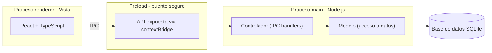

# LibreriaPOS - Documentacion del proyecto

Sistema de gestion de ventas e inventario para libreria, desarrollado con Electron.js como evolucion de un sistema previo en Excel con macros. Este documento registra el proceso de desarrollo completo: decisiones tecnicas, arquitectura, diseno de base de datos, seguridad y diseno de interfaz, a modo de bitacora de aprendizaje y referencia tecnica profesional.

## Indice

1. Contexto y objetivos del proyecto
2. Stack tecnologico
3. Configuracion del entorno
4. Control de versiones
5. Arquitectura del sistema
6. Diseno de interfaz (UI/UX)
7. Diseno de base de datos
8. Seguridad
9. Rendimiento y buenas practicas de codigo
10. Roadmap de modulos

---

## Contexto y objetivos del proyecto

El negocio contaba previamente con un sistema de gestion construido en Excel con macros VBA (3 anos en uso activo), que cubre control de inventario (compras al por mayor, precios, stock), registro de ventas con calculo de vuelto, y control de caja (ingresos/egresos). Este proyecto moderniza esa gestion con una aplicacion de escritorio real, sirviendo ademas como proyecto de portafolio profesional.

### Estrategia de desarrollo: MVP primero

Se descarto construir un ERP completo desde el inicio. Fases definidas:

**Fase 1 (MVP - en desarrollo):** Login con roles, Productos/Categorias/Unidades de medida, Control de inventario (movimientos), Ventas (POS), Caja (apertura/cierre), Reportes basicos. Se ajusto el alcance del MVP tras revisar el Excel real: el control de inventario detallado y el historial de precios de compra ya son funcionalidad activa de 3 anos, por lo que entran al MVP en vez de posponerse.

**Fase 2 (futuro):** Clientes, Proveedores, Compras (con detalle por factura), Devoluciones y Cambios de producto, Dashboard con graficos, permisos mas granulares.

**Fase 3 (futuro):** Kardex detallado, historial de precios como tabla dedicada, codigo de barras impreso para productos sin codigo de fabrica, impresion de tickets, copias de seguridad automaticas, facturacion electronica (SUNAT).

La base de datos se disena desde ahora pensando en el crecimiento hacia estas fases futuras, aunque el MVP solo construya las pantallas correspondientes a la Fase 1.

---

## Stack tecnologico

| Tecnologia | Rol |
|---|---|
| Electron.js | Framework para la app de escritorio |
| React + TypeScript | Interfaz de usuario (proceso renderer) |
| Vite + electron-vite | Bundler: compila JSX/TypeScript, conecta Vite con Electron, habilita hot reload en desarrollo |
| Node.js | Motor de ejecucion de JavaScript del proceso principal |
| SQLite (better-sqlite3) | Base de datos embebida, sin servidor |
| bcrypt | Hashing de contrasenas y codigos de recuperacion |
| Git + GitHub | Control de versiones y portafolio publico |

**Por que React + TypeScript:** la interfaz del sistema es inherentemente reactiva (canasta de venta que se actualiza en vivo, busqueda con resultados instantaneos, formularios con campos condicionales segun el tipo de operacion) - un caso de uso natural para React. TypeScript se adopto desde el inicio: al no existir una fecha limite de entrega, se prioriza invertir tiempo de aprendizaje en una herramienta que reduce errores en tiempo de ejecucion y mejora la mantenibilidad a medida que el proyecto crece hacia un sistema mas completo. Ambas decisiones ademas aportan valor de portafolio para el mercado laboral.

**Decisiones descartadas conscientemente:** Prisma ORM se evaluo pero se pospuso para las primeras fases; recuperacion de contrasena por correo electronico se descarto porque introduciria una dependencia de internet y de un servicio externo de envio de correos, contradiciendo la ventaja de que la app funcione localmente sin conexion.

---

## Configuracion del entorno

1. Node.js (LTS) instalado y verificado con `node -v` / `npm -v`.
2. Git instalado y configurado (`git config --global user.name/user.email`).
3. Proyecto generado con la plantilla oficial `npm create @quick-start/electron@latest` (framework `react`, TypeScript `Yes`), que integra Electron + React + TypeScript + Vite (via `electron-vite`) ya configurados y conectados entre si.
4. Base de datos: `npm install better-sqlite3` (sin `--save-dev`, ya que es dependencia de produccion, no solo de desarrollo).
5. Herramienta de apoyo para desarrollo: **DB Browser for SQLite**, para inspeccionar visualmente la base de datos mientras se programa (no forma parte de la aplicacion final).

**Estructura de carpetas de `src/` (generada por la plantilla, alineada con la arquitectura MVC del proyecto):**

| Carpeta | Rol | Equivale a |
|---|---|---|
| `src/main` | Proceso principal (Node.js) | Controlador + Modelo |
| `src/preload` | Puente seguro entre Main y Renderer | Conexion IPC |
| `src/renderer` | Interfaz en React | Vista |

La capa de acceso a datos vive en `src/main/database/db.js`, consistente con su rol dentro del proceso principal.

**Incidencias resueltas durante la instalacion:**
- Descarga del binario de Electron bloqueada por el firewall de Windows - resuelto desactivando temporalmente el firewall durante la primera instalacion.
- npm bloquea por defecto los scripts de instalacion de paquetes con codigo nativo (medida de seguridad `allow-scripts`) - Electron y better-sqlite3 requieren ese script para descargar/compilar su binario; se aprueban explicitamente con `npm approve-scripts --all`.

---

## Control de versiones

Repositorio publico en GitHub: `libreria-desktop-app`.

`.gitignore`:
```
node_modules/
dist/
*.log
.env
RECUPERACION-EMERGENCIA.md
```

`.gitattributes` (normaliza saltos de linea entre sistemas operativos):
```
* text=auto
```

**Nota de seguridad sobre control de versiones:** el archivo `RECUPERACION-EMERGENCIA.md` (procedimiento tecnico de ultimo recurso para regenerar credenciales directamente en la base de datos) se excluye deliberadamente del repositorio publico via `.gitignore`, ya que el repositorio es visible como parte del portafolio. Informacion operativa critica nunca se documenta en archivos que se suben a un repositorio publico.

**Flujo de trabajo:** commits frecuentes y descriptivos despues de cada avance funcional, en vez de subir todo el proyecto de una sola vez al final.

---

## Arquitectura del sistema

Electron impone una separacion de responsabilidades equivalente al patron MVC adaptado a una app de escritorio:



**El preload como refuerzo adicional de la regla de seguridad:** ademas de que el renderer nunca accede a la base de datos directamente, `src/preload` expone al renderer unicamente las funciones especificas que necesita (via `contextBridge`), en vez de darle acceso libre a todo Node.js. Es una capa extra de aislamiento sobre la separacion Vista/Controlador ya explicada abajo.

| Concepto MVC | Equivalente en Electron | Responsabilidad |
|---|---|---|
| Vista | Proceso renderer | Interfaz que el usuario ve y toca |
| Controlador | Handlers IPC en el proceso main | Recibe acciones, valida permisos por rol antes de ejecutar |
| Modelo | Capa de acceso a datos | Consultas SQL parametrizadas, reglas de negocio |

**Regla de seguridad central:** el proceso renderer nunca accede a la base de datos ni al sistema de archivos directamente; toda operacion pasa por el puente IPC hacia el proceso main. Esto aisla el riesgo si el renderer se ve comprometido, y centraliza la validacion de permisos por rol (ej. solo Administrador/Supervisor pueden modificar precios).

---

## Diseno de interfaz (UI/UX)

Referencia visual: diseno "ChainPOS - Restaurant POS System" (Dribbble), adaptado de un POS de restaurante a uno de libreria (sidebar con modulos colapsables + subcategorias conectadas por linea guia, grid de productos, panel de venta actual).

**Principios adoptados:** fondo claro/neutro con un solo color de acento; bordes sutiles en vez de recuadros gruesos; colores de stock como codificacion visual (verde/ambar); modo claro/oscuro mediante variables CSS con atributo `data-theme`; buscador unico con autocompletado y venta rapida por Enter, en vez de multiples campos de filtro simultaneos.

**Diseno pensado para lector de codigo de barras:** el campo de busqueda del POS detecta cuando el texto ingresado (seguido de Enter, tal como lo emite un lector USB) coincide exactamente con un codigo de producto, y en ese caso agrega el producto directo a la canasta en vez de solo mostrar sugerencias - flujo 100% operable sin mouse.

---

## Diseno de base de datos

### Principios aplicados en todo el esquema

- **Normalizacion (hasta 3FN):** ningun campo depende de otro que no sea la clave primaria; los catalogos (categorias, roles, unidades de medida) se relacionan por `id`, nunca duplicando su nombre en las tablas que los referencian.
- **Claves sustitutas vs. claves naturales:** cada tabla tiene un `id` autoincremental de uso interno (relaciones entre tablas), separado de un `codigo` legible para humanos donde aplica (ej. Productos) - las relaciones entre tablas siempre usan `id`.
- **Baja logica (soft delete):** los catalogos usan un campo `estado` (1 = activo, 0 = inactivo) en vez de eliminar filas fisicamente, preservando la integridad referencial de tablas relacionadas y permitiendo reactivar registros.
- **Tablas transaccionales como historial por diseno:** Ventas, MovimientosInventario y Caja nunca se editan ni se borran una vez creadas; cada fila es un hecho permanente. La trazabilidad esta garantizada por diseno, no por un campo adicional.
- **Trazabilidad de auditoria:** catalogos editables incluyen `actualizado_por` (referencia a Usuarios) y `fecha_actualizacion`, permitiendo saber quien y cuando modifico un registro.
- **Criterio para tabla vs. restriccion CHECK:** se usa una tabla catalogo cuando el valor es gestionable por el negocio desde una pantalla sin tocar codigo (Roles, UnidadesMedida); se usa `CHECK` cuando el valor esta ligado directamente a una rama de logica en el codigo y agregar uno nuevo requeriria tocar codigo de todas formas (`tipo` en MovimientosInventario).
- **Claves foraneas activas:** `PRAGMA foreign_keys = ON` se activa explicitamente al abrir la conexion, ya que SQLite las trae desactivadas por defecto.

### Tablas diseñadas hasta ahora

**Roles** - catalogo de roles del sistema (administrador, supervisor, cajero), gestionable sin tocar codigo.

**Usuarios** - login, hash de contrasena (bcrypt), relacion a Roles, y campos del modulo de autenticacion (ver seccion Seguridad).

**Categorias** - catalogo de categorias de producto.

**UnidadesMedida** - catalogo de unidades (unidad, caja, paquete, docena, resma...), compartido entre la unidad de venta de un producto y la unidad en que se registra una compra. Se decidio como tabla en vez de lista fija en codigo para que el negocio pueda gestionar unidades nuevas ("Otro" en la interfaz) sin depender de un desarrollador.

**Productos** - catalogo unificado de inventario (se descarto mantener tablas separadas de "por mayor" y "por menor" como en el Excel original, para evitar duplicidad de stock). Incluye `codigo` (interno, legible) y `codigo_barras` (opcional, de fabrica o generado internamente con prefijo reservado `2` para evitar colisiones con codigos reales), y un campo `nombre_busqueda` (version sin tildes y en minusculas, generada automaticamente) para soportar busqueda parcial tolerante a tildes.

**MovimientosInventario** - reemplaza la hoja "HISTORIAL_PRODUCTOS" del Excel. Registra cada entrada, salida o ajuste de stock; de aqui se deriva el historial de precios de compra sin necesitar una tabla separada, ya que cada fila queda inmutable con su `precio_compra_unitario` y fecha.

*(Pendientes de diseñar: SesionesCaja, MovimientosCaja, Ventas, DetalleVenta)*

---

## Seguridad

### Contraseñas: hashing con bcrypt

Las contraseñas nunca se almacenan en texto plano. Se guarda unicamente el resultado de `bcrypt.hash()` en el campo `password_hash` (nombrado asi deliberadamente, no `password`, para que el propio nombre del campo prevenga el error de guardar el valor sin hashear). La verificacion en el login usa `bcrypt.compare()`, que nunca revierte el hash, solo confirma si una contraseña produce ese mismo hash. Ni el administrador ni el desarrollador pueden recuperar una contraseña original a partir de su hash.

### Prevencion de SQL Injection

Toda consulta que incorpore datos escritos por el usuario (busquedas, formularios) usa **consultas parametrizadas** (`?` en la sentencia SQL en vez de concatenar texto directamente), soportado nativamente por `better-sqlite3`. Esto es una regla aplicada sin excepcion en el proyecto, no solo en el login.

### Politica de autenticacion y recuperacion de acceso

| Escenario | Mecanismo |
|---|---|
| Usuario conoce su contraseña y quiere cambiarla (incluye Administrador) | Formulario con contraseña actual + nueva + confirmar |
| Primer inicio de sesion (contraseña temporal asignada por el administrador) | Cambio de contraseña obligatorio antes de acceder al sistema; al completarlo se genera un codigo de recuperacion personal (mostrado una unica vez) |
| Usuario olvido su contraseña (cualquier rol, incluido Administrador) | Pantalla "Olvide mi contraseña": usuario + codigo de recuperacion → define nueva contraseña → se genera un codigo nuevo (el anterior queda invalidado) |
| Administrador olvido tambien su codigo de recuperacion | Archivo `recovery.key` (respaldo adicional exclusivo del rol Administrador, generado en su primer inicio de sesion y guardado fuera de la maquina, ej. USB o nube personal) |
| Multiples intentos fallidos de codigo de recuperacion | Bloqueo automatico de la cuenta tras 5 intentos; el desbloqueo requiere intervencion del Administrador |

Tanto el codigo de recuperacion como el archivo `recovery.key` se almacenan como hash (`codigo_recuperacion_hash`, `archivo_recuperacion_hash`), nunca en texto plano - mismo principio que la contraseña.

### Control de acceso por rol

La base de datos no impone permisos por si misma (SQLite no soporta usuarios/permisos como motores cliente-servidor); el control de acceso se implementa en la capa de Controlador (proceso main), verificando el rol del usuario autenticado antes de autorizar operaciones sensibles (editar precios, gestionar usuarios, ver reportes). Roles planificados: Administrador (acceso total), Supervisor (gestion de productos, precios, reportes), Cajero (solo modulo de ventas).

### Trazabilidad contra perdidas o irregularidades de caja

El mecanismo real de control frente a posibles irregularidades no son los campos de auditoria de los catalogos, sino que cada venta y cada movimiento de caja quedan asociados al `usuario_id` que los registro junto con fecha y hora exacta, permitiendo contrastar el efectivo esperado en caja contra lo registrado por cada cajero en su turno.

---

## Rendimiento y buenas practicas de codigo

- **Indices automaticos:** los campos declarados `UNIQUE` (codigo, codigo_barras, usuario de login) generan un indice automaticamente en SQLite, acelerando las busquedas por esos campos a medida que el catalogo crece.
- **Busqueda por coincidencia parcial:** el buscador de productos usa `LIKE '%texto%'` con el comodin `%` construido por el codigo (nunca escrito por el usuario), sobre el campo `nombre_busqueda` normalizado (sin tildes, minusculas) para que la busqueda sea tolerante a como el usuario escriba.
- **Normalizacion de texto en catalogos gestionables por el usuario:** valores nuevos ingresados via la opcion "Otro" (ej. unidades de medida) se normalizan automaticamente (primera letra mayuscula, resto minuscula, sin espacios sobrantes) antes de guardarse, para evitar duplicados por inconsistencia de escritura.
- **Costo de las validaciones y transformaciones en el cliente:** operaciones como el hashing con bcrypt (deliberadamente lento, por diseño, para dificultar ataques de fuerza bruta) y la normalizacion de texto (computacionalmente trivial) se evaluan por su proposito y costo real, no se descartan por una preocupacion generica de "lentitud" sin medirla primero.
- **Doble validacion (interfaz + base de datos):** los formularios validan de forma inmediata y amigable en la interfaz; la base de datos valida de nuevo con restricciones (`NOT NULL`, `UNIQUE`, `CHECK`) como ultima linea de defensa ante bugs o casos no contemplados en la interfaz.

---

## Roadmap de modulos

- [x] Fundamentos de Electron y configuracion del entorno
- [x] Primera ventana funcional
- [x] Repositorio Git/GitHub configurado
- [x] Diseno de UI/UX definido (paleta, layout, modo claro/oscuro)
- [x] Arquitectura del sistema definida
- [x] Diseno conceptual de base de datos: Roles, Usuarios, Categorias, UnidadesMedida, Productos, MovimientosInventario
- [x] Politica de autenticacion y recuperacion de acceso definida
- [x] Tablas implementadas en `src/main/database/db.js`
- [ ] Tablas de Caja (SesionesCaja, MovimientosCaja) y Ventas/DetalleVenta
- [ ] Modulo de Login
- [ ] Modulo de Productos/Categorias/Unidades de medida
- [ ] Modulo de Ventas (POS)
- [ ] Modulo de Caja
- [ ] Modulo de Reportes
- [ ] Empaquetado y distribucion (.exe)

---

*Ultima actualizacion: documento en construccion, se amplia en cada sesion de desarrollo.*
