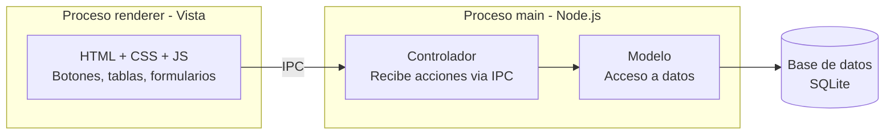

# LibreriaPOS - Documentacion del proyecto

Sistema de gestion de ventas e inventario para libreria, desarrollado con Electron.js como evolucion de un sistema previo en Excel con macros. Este documento registra el proceso de desarrollo completo: decisiones tecnicas, arquitectura, diseno de base de datos y diseno de interfaz, a modo de bitacora de aprendizaje y referencia tecnica.

## Indice

1. Contexto y objetivos del proyecto
2. Stack tecnologico
3. Configuracion del entorno
4. Control de versiones
5. Arquitectura del sistema
6. Diseno de interfaz (UI/UX)
7. Diseno de base de datos
8. Roadmap de modulos

---

## Contexto y objetivos del proyecto

El negocio contaba previamente con un sistema de gestion construido en Excel con macros VBA, que cubria dos areas: control de inventario (productos al por mayor y al detalle) y registro de ventas con calculo de vuelto. Ese sistema, aunque funcional, presenta limitaciones propias de Excel: falta de control de usuarios, duplicidad de datos entre inventarios, y dificultad para escalar.

Este proyecto busca:
- Modernizar la gestion del negocio con una aplicacion de escritorio real
- Servir como proyecto de portafolio profesional
- Aplicar buenas practicas de arquitectura de software desde el dia uno
- Crecer de forma incremental: un MVP funcional primero, un sistema mas completo (tipo ERP) despues

### Estrategia de desarrollo: MVP primero

Se descarto construir un ERP completo desde el inicio. En su lugar, se definieron fases:

**Fase 1 (MVP - en desarrollo):** Login, Productos/Categorias, Ventas (POS), Caja, Reportes basicos. Suficiente para reemplazar el Excel actual y ponerse en marcha en el negocio.

**Fase 2 (futuro):** Clientes, Proveedores, Compras, Dashboard con graficos, roles de usuario mas granulares.

**Fase 3 (futuro):** Inventario avanzado/Kardex, codigo de barras, impresion de tickets, copias de seguridad automaticas, facturacion electronica (SUNAT).

La base de datos, sin embargo, se disena desde ahora pensando en el crecimiento hacia fases futuras.

---

## Stack tecnologico

| Tecnologia | Rol |
|------------|-----|
| Electron.js | Framework para la app de escritorio |
| HTML + CSS + JavaScript (vanilla) | Interfaz de usuario, sin frameworks adicionales por ahora |
| Node.js | Motor de ejecucion de JavaScript del proceso principal |
| SQLite (better-sqlite3) | Base de datos embebida, sin servidor |
| Git + GitHub | Control de versiones y portafolio publico |

**Nota sobre decisiones descartadas:** se evaluo usar React, TypeScript, Prisma ORM y otras herramientas modernas desde el inicio, pero se decidio posponerlas. La prioridad es tener el sistema funcionando en el negocio cuanto antes, sin la curva de aprendizaje adicional de varias tecnologias nuevas a la vez.

**Nota sobre la base de datos:** se eligio SQLite sobre MySQL/PostgreSQL/SQL Server porque el sistema corre en un solo local (o red local pequena), sin necesidad de un servidor de base de datos aparte. Si el negocio crece a multiples sucursales con acceso remoto, la migracion a un motor cliente-servidor es posible sin redisenar la aplicacion, siempre que el codigo de acceso a datos se mantenga en una capa separada (ver seccion Arquitectura).

---

## Configuracion del entorno

1. Node.js instalado (version LTS) - motor de JavaScript fuera del navegador, necesario para correr Electron.
2. Git instalado y configurado con nombre y correo (git config --global user.name/user.email).
3. VS Code como editor.
4. Proyecto inicializado con npm init -y, generando package.json.
5. Electron instalado como dependencia de desarrollo: npm install electron --save-dev.

**Incidencias resueltas durante la instalacion** (documentadas por su valor de aprendizaje en depuracion):
- Descarga del binario de Electron bloqueada por el firewall de Windows - resuelto desactivando temporalmente el firewall durante la primera instalacion.
- Ventana de Electron sin renderizar (procesos corriendo pero sin UI visible) - resuelto con app.disableHardwareAcceleration() en main.js, indicativo de un problema de aceleracion por GPU.

---

## Control de versiones

Repositorio publico en GitHub: libreria-desktop-app, pensado como parte del portafolio.

**Archivos de configuracion clave:**

.gitignore:
```
node_modules/
dist/
*.log
.env
```

.gitattributes (normaliza saltos de linea entre Windows/Mac/Linux):
```
* text=auto
```

**Flujo de trabajo:** commits frecuentes y descriptivos despues de cada avance funcional (por ejemplo, "Configuracion inicial: Electron con ventana basica funcionando"), en vez de subir todo el proyecto de una sola vez al final. El historial de commits es en si mismo evidencia de proceso de trabajo para quien revise el repositorio.

---

## Arquitectura del sistema

Electron impone de forma natural una separacion de responsabilidades equivalente al patron MVC:



| Concepto MVC | Equivalente en Electron | Responsabilidad |
|---|---|---|
| Vista (View) | Proceso renderer | Interfaz que el usuario ve y toca |
| Controlador (Controller) | Handlers IPC en el proceso main | Recibe acciones del renderer, decide que hacer |
| Modelo (Model) | Capa de acceso a datos | Consultas SQL, validaciones, reglas de negocio |

**Regla de seguridad central:** el proceso renderer nunca accede a la base de datos ni al sistema de archivos directamente. Toda operacion pasa por el puente IPC hacia el proceso main, que es el unico con esos permisos. Esto aisla el riesgo en caso de que el renderer (que corre contenido tipo navegador) se vea comprometido, y centraliza la validacion de permisos (por ejemplo, verificar el rol del usuario antes de autorizar una operacion sensible).

---

## Diseno de interfaz (UI/UX)

### Referencia de diseno

Se tomo como referencia visual el diseno "ChainPOS - Restaurant POS System" (Dribbble, por ItWorks Agency), adaptando su estructura a un negocio de libreria:

| En el diseno original (restaurante) | Adaptado a la libreria |
|---|---|
| Sidebar con Dashboard, Manage Table, Manage Dish | Sidebar con Ventas, Productos, Caja, Reportes |
| Grid de platillos con imagen, nombre, precio | Grid de productos con imagen/color, stock, precio |
| Panel "Prepared Order" (carrito) | Panel "Venta actual" (canasta de compra) |
| Boton "Process Payment" | Boton "Cobrar" |

### Principios de diseno adoptados

- Fondo claro/neutro con un solo color de acento (evita el "todo azul solido" del sistema Excel original, que cansa la vista en jornadas largas).
- Bordes sutiles en vez de recuadros gruesos (estilo GroupBox de los anos 2000).
- Colores de stock como codificacion visual: verde (stock normal), ambar (stock bajo), en vez de solo texto de alerta.
- Sidebar jerarquico: modulos colapsables con subcategorias, conectadas por una linea guia vertical sutil (gris, no del color de acento) para agrupar visualmente sin ocupar espacio adicional cuando el modulo esta colapsado.

### Modo claro / oscuro

Implementado mediante variables CSS (custom properties), permitiendo alternar tema cambiando un unico atributo en el HTML:

```css
:root {
  --bg-primary: #ffffff;
  --text-primary: #1a1a1a;
}

[data-theme="dark"] {
  --bg-primary: #1a1a1a;
  --text-primary: #f5f5f5;
}
```

La preferencia del usuario se guardara localmente para persistir entre sesiones (pendiente de implementacion).

### Mejoras de UX definidas para el modulo de Ventas (POS)

Basadas en el sistema Excel original, en investigacion propia y en sugerencias contrastadas con otra IA (documentadas criticamente, no adoptadas sin analisis):

- Buscador unico (codigo/nombre) con filtros avanzados ocultos, en vez de 5 campos de busqueda simultaneos.
- Autocompletar mientras se escribe.
- Venta rapida: codigo + Enter agrega el producto sin clics adicionales.
- Calculo de vuelto automatico al escribir el monto recibido (sin boton "Calcular").
- Categoria y marca se muestran como texto secundario bajo el nombre del producto, no como columnas separadas en la canasta.

---

## Diseno de base de datos

Disenada pensando en el crecimiento hacia fases futuras (Clientes, Proveedores, Compras), aunque el MVP solo construya las pantallas de las tablas listadas abajo.

**Tablas planificadas:** Categorias -> Usuarios -> Productos -> Ventas -> DetalleVenta -> Caja. Se construyen en ese orden, de menor a mayor complejidad relacional.

### Tabla: Categorias

```sql
CREATE TABLE Categorias (
  id INTEGER PRIMARY KEY AUTOINCREMENT,
  nombre TEXT NOT NULL UNIQUE,
  activo INTEGER DEFAULT 1
);
```

| Campo | Tipo | Descripcion |
|---|---|---|
| id | INTEGER (PK, autoincremental) | Identificador unico generado automaticamente |
| nombre | TEXT (obligatorio, unico) | Nombre de la categoria, no se permiten duplicados |
| activo | INTEGER (0 o 1, default 1) | Baja logica: en vez de eliminar un registro, se marca inactivo para permitir recuperacion y no romper referencias de otras tablas |

**Conceptos aplicados:** clave primaria autoincremental, restricciones de integridad (NOT NULL, UNIQUE), y el patron de "desactivar en vez de eliminar" (soft delete), estandar en sistemas de gestion reales.

(Las siguientes tablas se documentaran aqui a medida que se disenen: Usuarios, Productos, Ventas, DetalleVenta, Caja.)

---

## Roadmap de modulos

- [x] Fundamentos de Electron y configuracion del entorno
- [x] Primera ventana funcional
- [x] Repositorio Git/GitHub configurado
- [x] Diseno de UI/UX definido (paleta, layout, modo claro/oscuro)
- [x] Arquitectura del sistema definida
- [ ] Esquema completo de base de datos (en progreso)
- [ ] Modulo de Login
- [ ] Modulo de Productos/Categorias
- [ ] Modulo de Ventas (POS)
- [ ] Modulo de Caja
- [ ] Modulo de Reportes
- [ ] Empaquetado y distribucion (.exe)

---

*Ultima actualizacion: documento en construccion, se amplia en cada sesion de desarrollo.*
